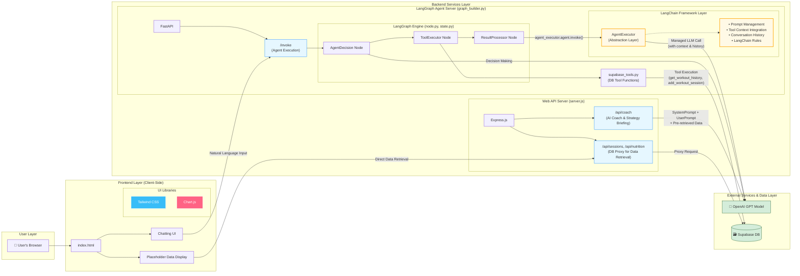

# pjt-final-gaida

## 🚀 프로젝트 소개

`pjt-final-gaida`는 사용자의 운동 기록과 식단 데이터를 관리하고, AI 코치를 통해 개인화된 피드백과 전략을 제공하는 웹 애플리케이션입니다. 사용자는 자신의 운동 세션을 기록하고, '승리의 연대기' 차트를 통해 성장을 시각적으로 확인할 수 있으며, AI 에이전트와 대화하며 운동 기록을 조회하거나 추가할 수 있습니다.

## 🏛️ 아키텍처 (Architecture)

본 프로젝트는 **이중 백엔드(Dual Backend)** 구조를 채택하여 웹 서비스와 AI 에이전트 기능을 분리하고 확장성을 확보했습니다.

-   **Express.js (Node.js) 백엔드**: 프론트엔드의 메인 API 서버 역할을 합니다. AI 코칭, 전략 브리핑, 데이터베이스 프록시 기능을 수행합니다.
-   **FastAPI (Python) 백엔드**: LangGraph 기반의 ReAct 에이전트를 API로 제공합니다. 복잡한 Tool-Calling 로직을 처리하여 사용자의 자연어 요청(예: "내 운동 기록 보여줘")을 수행합니다.



## ✨ 주요 기능 (Key Features)

-   **운동 및 식단 기록**: 양식을 통한 직접 입력 방식과, 채팅창에 메모를 붙여넣어 AI 에이전트에게 데이터 추가를 요청하는 자연어 기반 입력 방식을 모두 지원합니다.
-   **AI 코칭 및 전략 브리핑**: 저장된 데이터를 기반으로 AI 코치가 개인화된 운동/식단 조언과 분석 리포트를 제공합니다.
-   **자연어 상호작용**: LangGraph 기반 AI 에이전트와 대화(또는 음성)하여 "오늘 운동 뭐했지?"와 같이 자연어로 운동 기록을 조회하거나 추가할 수 있습니다.
-   **성장 시각화**: Chart.js를 활용한 '승리의 연대기' 차트를 통해 운동 볼륨 등의 성장 과정을 시각적으로 추적합니다.
-   **안전한 데이터 관리**: 모든 사용자 데이터는 Supabase 데이터베이스에 안전하게 저장되며, API 키 등 민감 정보는 서버에서 안전하게 관리됩니다.

## 🛠️ 기술 스택 (Tech Stack)

### 프론트엔드
*   **Tailwind CSS**: 반응형 디자인, 다크 모드 등 전체 UI 스타일링을 위한 유틸리티 우선 CSS 프레임워크.
*   **Chart.js**: '승리의 연대기' 기능에서 사용자의 운동 볼륨 변화를 시각화하는 차트 라이브러리.

### 백엔드
1.  **Express.js (Node.js)**
    *   **역할**: 웹 애플리케이션의 메인 API 서버.
    *   **주요 기능**: AI 코치(GPT 호출), Supabase 데이터 프록시.
2.  **FastAPI (Python)**
    *   **역할**: LangGraph 기반 ReAct 에이전트 API 서버.
    *   **주요 기능**: Tool-Calling, 자연어 기반 DB 상호작용.

### 데이터베이스
*   **Supabase**: PostgreSQL 기반의 BaaS(Backend as a Service). 운동 및 식단 데이터 저장소로 사용됩니다.

### AI & 에이전트
*   **GPT (OpenAI)**: AI 코치 기능과 에이전트의 의도 분석 및 Tool-Calling 결정에 사용되는 핵심 LLM.
*   **LangGraph**: ReAct 패턴의 AI 에이전트를 구축하기 위한 프레임워크. `AgentDecision`, `ToolExecutor` 등의 노드를 정의하여 상태 기반의 자율적 에이전트를 구현합니다.
*   **LangChain**: LangGraph의 기반 기술. LLM, Tool, Prompt를 유기적으로 결합하는 데 사용됩니다.

## 🏁 실행 방법 (Quick Start)

### 1. 환경 변수 설정

프로젝트 루트 디렉토리에 `.env` 파일을 생성하고, 아래 내용을 각자의 키 값으로 채워주세요.

```.env
# OpenAI API Key
OPENAI_API_KEY="YOUR_OPENAI_API_KEY"

# Supabase Credentials
SUPABASE_URL="YOUR_SUPABASE_URL"
SUPABASE_ANON_KEY="YOUR_SUPABASE_ANON_KEY"
```

### 2. 백엔드 서버 실행

본 프로젝트는 두 개의 백엔드 서버로 구성되어 있으며, 두 서버를 모두 실행해야 모든 기능이 정상적으로 동작합니다.

#### A. LangGraph 에이전트 서버 (FastAPI)

```bash
# langgraph-agent 디렉토리로 이동
cd langgraph-agent

# (선택) Python 가상 환경 생성 및 활성화
# python3 -m venv venv && source venv/bin/activate

# 종속성 설치
pip install -r requirements.txt

# 서버 실행
uvicorn graph_builder:fastapi_app --reload
```

#### B. 웹 애플리케이션 서버 (Express.js)

```bash
# web 디렉토리로 이동
cd web

# 종속성 설치
npm install

# 서버 실행
node server.js
```

### 3. 프론트엔드 접근

두 서버가 모두 실행된 후, 웹 브라우저를 열어 `http://localhost:3000` 주소로 접속하면 애플리케이션을 사용할 수 있습니다.
