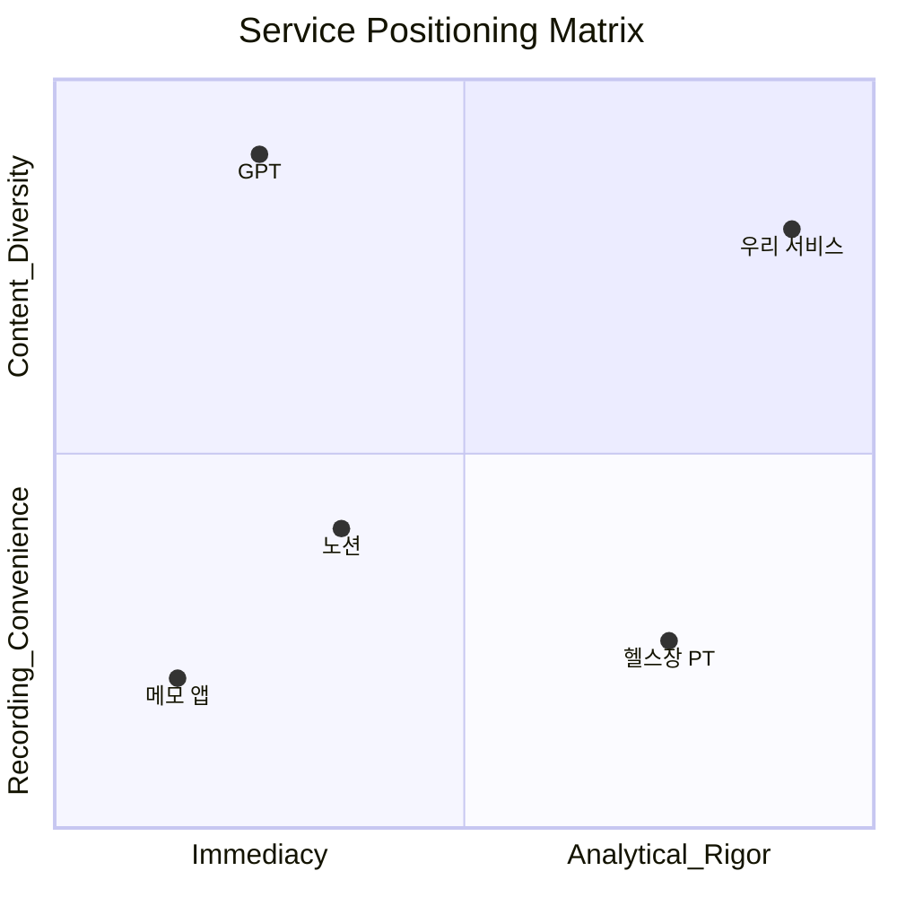
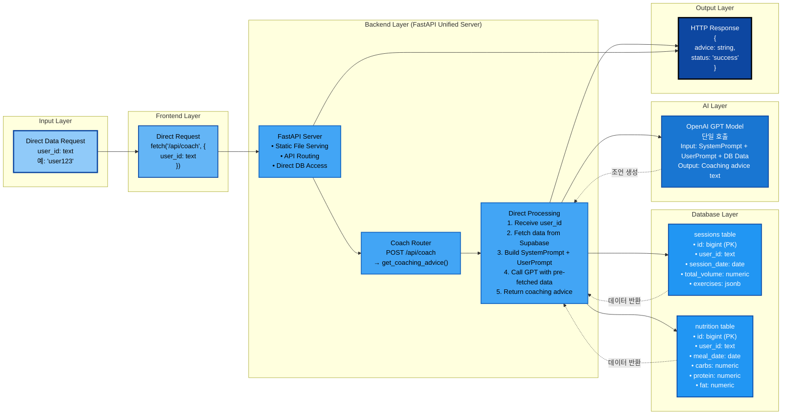
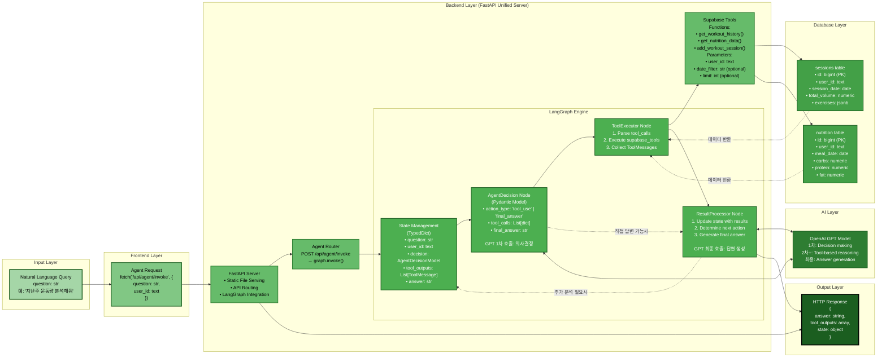

# VS-ME

## 🚀 프로젝트 소개

VS-ME는 정체기를 극복하고 자신의 수행능력을 키워가고 싶은 개인을 위한 플랫폼입니다.
운동·식단뿐만 아니라 수면, 영양제 등 사용자가 원하는 데이터를 자유롭게 기록할 수 있으며, AI는 이를 바탕으로 신뢰성 있는 성장 피드백을 제공합니다.


### 핵심 가치
**데이터 기록 유연성**
* **운동, 식단뿐만 아니라 개인이 원하는 모든 항목(예: 수면, 영양제, 컨디션)을 jsonb 형식으로 저장 가능**
* **개인화된 데이터 스키마를 강제하지 않고, 사용자가 원하는 만큼 확장 가능**

**AI 기반 분석 보고서와 실시간 조언**
* **LangGraph 기반 에이전트가 자연어 요청(NLQ)을 이해하고 적절한 Tool을 호출**
* **GPT 모델이 단순 요약이 아니라, 개인의 누적 데이터를 바탕으로 신뢰성 높은 전략적 피드백 제공**

**단기적 /장기적 성장 별도 분석 전략**
* **Chart.js 기반의 운동별 분석 시각화와 리포트를 통해 단기적인 성과와 장기적인 성장을 동시에 관리**

### ✨ 핵심 기능
**AI 코치 기능 (실시간)**
* **LangGraph 기반으로 DB에서 필요한 데이터만 가져와 응답**
* **운동/식단/수면/영양제 등 유연한 데이터 입력 지원**
* **자연어 기반 개인 맞춤 조언 제공**

**AI 분석 기능 (비실시간)**
* **LLM이 사용자의 모든 데이터를 직접 분석**
* **개인화 보고서 생성 및 성장 전략 제안**

**데이터 시각화**
* **운동별 “승리의 연대기” 차트를 통해 수행능력 변화 추세**
* **최대 수행능력 달성 유무 시각화**

### 📊 우리의 Positioning

- 우리 서비스의 포지션은 **“즉각성보다 타당성, 기록 편의성보다 콘텐츠 다양성”**입니다.




- 즉, GPT는 빠르고 즉각적인 응답에 강점이 있는 반면,
- 우리 서비스는 충분한 데이터를 모으고 분석하여 개인의 성장에 타당한 인사이트를 제공하는 데 집중합니다.

### ⚠️ UX 관점
- 우리 서비스의 UI는 직관적이거나 단순하지 않습니다.
- 그러나 이는 단순 기록 도구가 아니라, 성장 지향적 분석 플랫폼이라는 포지션을 강화합니다.

👉 요약하자면, **“내가 넣고 싶은 모든 데이터를 기반으로, GPT가 주지 못하는 타당성 있는 성장 피드백을 주는 서비스”**입니다.

## 🏛️ 아키텍처 (Architecture)

본 프로젝트는 **단일 FastAPI 백엔드** 구조를 채택하여 웹 서비스와 AI 에이전트 기능을 통합 제공합니다. 이를 통해 프로젝트 구조를 단순화하고, 배포 및 유지보수 효율성을 극대화했습니다.

* **FastAPI (Python) 백엔드**
  * 정적 파일(index.html, CSS, JS 등) 서빙
  * Supabase 연동 RESTful API 엔드포인트 제공 (`/api/sessions`, `/api/nutrition` 등) 
  * AI 코칭 엔드포인트:
    * `/api/coach`: 직접 GPT 호출 방식 (사전 데이터 조회 후 단일 응답)
    * `/api/agent/invoke`: LangGraph 기반 에이전트 (도구 호출 및 반복적 추론)

* **Supabase (DB + 인증/보안 레이어)**
  * 모든 데이터는 `jsonb` 형태로 유연하게 저장
  * Row Level Security(RLS) 정책을 통해 사용자별 데이터 접근 제어


### data-flow

#### total-data-flow

```mermaid
graph LR
    subgraph Input["Input Layer"]
        direction TB
        NLQ["Natural Language Query<br/>question: str<br/>예: '지난주 운동량 분석해줘'"]
        DIR["Direct Data Request<br/>user_id: text<br/>예: 'user123'"]
    end
    
    subgraph Frontend["Frontend Layer"]
        direction TB
        REQ_Agent["Agent Request<br/>POST /api/agent/invoke"]
        REQ_Direct["Direct Request<br/>POST /api/coach"]
    end
    
    subgraph Backend["Backend Layer (FastAPI Unified Server)"]
        direction TB
        FASTAPI["FastAPI Server<br/>단일 진입점"]
        
        subgraph DirectPath["Direct Flow Path (Simple)"]
            ROUTER_Direct["Coach Router"]
            PROCESS_Direct["Direct Processing<br/>• Fetch DB data<br/>• Build prompt<br/>• Single GPT call"]
        end
        
        subgraph AgentPath["Agent Flow Path (Complex)"]
            ROUTER_Agent["Agent Router"]
            
            subgraph LangGraph["LangGraph Engine"]
                direction TB
                STATE["State<br/>Management"]
                DECISION["Agent<br/>Decision<br/>(GPT 1차)"]
                EXECUTOR["Tool<br/>Executor"]
                PROCESSOR["Result<br/>Processor<br/>(GPT 최종)"]
            end
        end
        
        TOOLS["Supabase Tools<br/>• get_workout_history()<br/>• get_nutrition_data()<br/>• add_workout_session()"]
    end
    
    subgraph Database["Database Layer (Supabase)"]
        direction TB
        SESSIONS["sessions table"]
        NUTRITION["nutrition table"]
    end
    
    subgraph AI["AI Layer"]
        direction TB
        GPT["OpenAI GPT Model"]
    end
    
    subgraph Output["Output Layer"]
        direction TB
        RESPONSE_Direct["Direct Response<br/>{ advice: string }"]
        RESPONSE_Agent["Agent Response<br/>{ answer: string, tool_outputs: array }"]
    end
    
    %% Input to Frontend
    NLQ --> REQ_Agent
    DIR --> REQ_Direct
    
    %% Frontend to Backend
    REQ_Agent --> FASTAPI
    REQ_Direct --> FASTAPI
    
    %% FastAPI Routing
    FASTAPI --> ROUTER_Agent
    FASTAPI --> ROUTER_Direct
    
    %% Direct Flow (Blue Path)
    ROUTER_Direct --> PROCESS_Direct
    PROCESS_Direct --> SESSIONS
    PROCESS_Direct --> NUTRITION
    SESSIONS -.->|데이터 반환| PROCESS_Direct
    NUTRITION -.->|데이터 반환| PROCESS_Direct
    PROCESS_Direct --> GPT
    GPT -.->|조언 생성| PROCESS_Direct
    PROCESS_Direct --> RESPONSE_Direct
    
    %% Agent Flow (Green Path)
    ROUTER_Agent --> STATE
    STATE --> DECISION
    DECISION --> EXECUTOR
    EXECUTOR --> TOOLS
    EXECUTOR --> PROCESSOR
    TOOLS --> SESSIONS
    TOOLS --> NUTRITION
    SESSIONS -.->|데이터 반환| EXECUTOR
    NUTRITION -.->|데이터 반환| EXECUTOR
    PROCESSOR -.->|추가 분석| STATE
    DECISION <--> GPT
    PROCESSOR <--> GPT
    PROCESSOR --> RESPONSE_Agent
    
    %% Output
    FASTAPI --> RESPONSE_Direct
    FASTAPI --> RESPONSE_Agent
    
    %% Styling
    classDef input fill:#fff9c4,stroke:#f57f17,stroke-width:3px,color:#000
    classDef frontend fill:#ffe082,stroke:#f57f17,stroke-width:2px,color:#000
    classDef fastapi fill:#9c27b0,stroke:#4a148c,stroke-width:3px,color:#fff
    classDef directFlow fill:#42a5f5,stroke:#0d47a1,stroke-width:2px,color:#000
    classDef agentFlow fill:#66bb6a,stroke:#1b5e20,stroke-width:2px,color:#000
    classDef langgraph fill:#4caf50,stroke:#1b5e20,stroke-width:2px,color:#fff
    classDef tools fill:#81c784,stroke:#2e7d32,stroke-width:2px,color:#000
    classDef database fill:#ff9800,stroke:#e65100,stroke-width:2px,color:#000
    classDef ai fill:#e91e63,stroke:#880e4f,stroke-width:2px,color:#fff
    classDef output fill:#607d8b,stroke:#263238,stroke-width:3px,color:#fff
    
    class NLQ,DIR input
    class REQ_Agent,REQ_Direct frontend
    class FASTAPI fastapi
    class ROUTER_Direct,PROCESS_Direct directFlow
    class ROUTER_Agent agentFlow
    class STATE,DECISION,EXECUTOR,PROCESSOR langgraph
    class TOOLS tools
    class SESSIONS,NUTRITION database
    class GPT ai
    class RESPONSE_Direct,RESPONSE_Agent output
```

#### Direct-Flow
- 처리 단계: Frontend → FastAPI → Router → Direct Processing

#### Agent-Flow
## Agent Flow (LangGraph 기반 AI 에이전트)

### 처리 단계
- **Input → Frontend → FastAPI Router → LangGraph State Management → Agent Decision → Tool Execution → Database**
- State ↔ Decision ↔ GPT 간 피드백 루프를 통한 반복적 추론
- 다중 GPT 호출 가능:
  - 1차 호출: AgentDecision에서 초기 의사결정 (tool_use 여부 판단)
  - 2차+ 호출: Tool 실행 결과를 바탕으로 추가 분석 필요 시
  - 최종 호출: ResultProcessor에서 모든 정보를 종합하여 최종 답변 생성

### 아키텍처 특징
- **FastAPI 서버**: FastAPI가 모든 요청 처리
- **직접 연결**: 프론트엔드에서 `/api/agent/invoke` 엔드포인트로 직접 LangGraph 호출
- **상태 관리**: TypedDict 기반 State로 대화 컨텍스트 유지
- **도구 기반 추론**: Supabase Tools를 활용한 데이터 기반 의사결정

## 🛠️ 기술 스택 (Tech Stack)

### 프론트엔드

* **Tailwind CSS**: 전체 UI 스타일링을 위한 유틸리티 우선 CSS 프레임워크. 반응형 디자인과 일관된 레이아웃 제공.
* **Chart.js**: 사용자의 기록 데이터를 기반으로 그래프 및 차트 시각화.

### 백엔드
**FastAPI (Python)**
   * **역할**: 웹 애플리케이션의 API 서버, LangGraph 기반 ReAct 에이전트 API 서버.
   * **주요 기능**: 자연어 질의 처리, Tool-Calling, 데이터베이스 상호작용.

### 데이터베이스
* **Supabase (PostgreSQL 기반)**: 사용자 운동/식단/기타 데이터 저장 및 관리. 백엔드 및 AI 에이전트에서 모두 접근 가능.

### AI & 에이전트
* **GPT (OpenAI)**: AI 코치 및 LangGraph 에이전트의 분석/피드백 생성.
* **LangGraph**: ReAct 패턴 기반의 상태 기반 자율 에이전트 구축. `AgentDecision`, `ToolExecutor` 노드를 활용.
* **LangChain**: LLM, Tool, Prompt 결합을 통한 LangGraph 에이전트 실행 기반 제공.

좋아요. 말씀하신 내용 반영해서 **Supabase DB 세팅 포함**, 순서 재정리된 **Quick Start** 전체를 Markdown 형식으로 작성했습니다.

---

## 🏁 Quick Start


### 1. 환경 변수 설정

프로젝트 루트 디렉토리에 `.env` 파일을 생성하고, 아래 내용을 각자의 키 값으로 채워주세요.

```env
# OpenAI API Key
OPENAI_API_KEY="YOUR_OPENAI_API_KEY"

# Supabase Credentials
SUPABASE_URL="YOUR_SUPABASE_URL"
SUPABASE_ANON_KEY="YOUR_SUPABASE_ANON_KEY"
```

---

### 2. Supabase DB 세팅

1. Supabase 프로젝트를 생성합니다.
2. `.env` 파일에 Supabase URL과 Anon Key를 설정합니다 (아래 참조).
3. `tablecreate.sql` 파일에 있는 쿼리를 Supabase SQL Editor 또는 CLI를 통해 실행하여 데이터베이스 스키마를 생성합니다.

```bash
# supabase CLI 예시
supabase db connect
psql "postgresql://<user>:<password>@<host>:<port>/<database>" -f tablecreate.sql
```

> **참고**: `tablecreate.sql`에는 운동, 식단, 세션 등 프로젝트에서 필요한 모든 테이블과 초기 구조가 정의되어 있습니다.

---

### 3. 백엔드 서버 실행

본 프로젝트는 **두 개의 백엔드 서버**로 구성되어 있으며, 두 서버를 모두 실행해야 모든 기능이 정상적으로 동작합니다.

#### A. LangGraph 에이전트 서버 (FastAPI)

```bash
# langgraph-agent 디렉토리로 이동
cd langgraph-agent

# (선택) Python 가상 환경 생성 및 활성화
# python3 -m venv venv && source venv/bin/activate

# 종속성 설치
pip install -r requirements.txt

# 서버 실행
uvicorn graph_builder:fastapi_app --reload
```


---

### 4. 프론트엔드 접근

두 서버가 모두 실행된 후, 웹 브라우저를 열어 아래 주소로 접속하면 애플리케이션을 사용할 수 있습니다.

```
http://localhost:3000
```


### Directory structure (Before version)
```
web
.
├── index.html
├── node_modules
├── package-lock.json
├── package.json
├── server.js
└── tablecreate.sql

langgraph-agent
.
├── graph_builder.py
├── langgraph.ipynb
├── langgraph.json
├── langgraph.log
├── llm-systemprompt.md
├── node.py
├── requirements.txt
├── state.py
├── supabase_tools.py
├── test_decision_to_tool_flow.py
├── test_node.py
├── test_state.py
└── test_supabase_tools.py
```