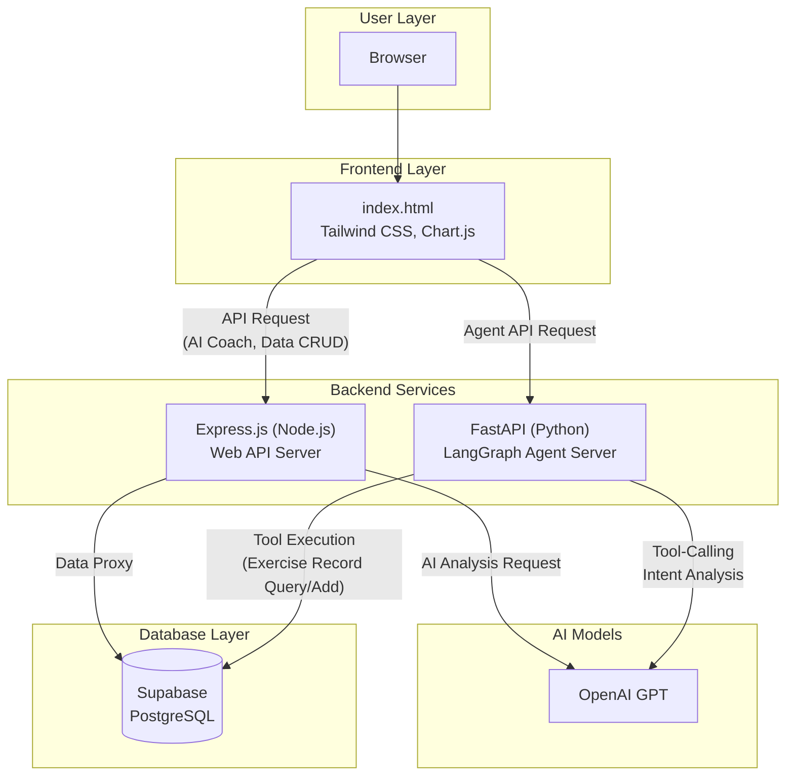
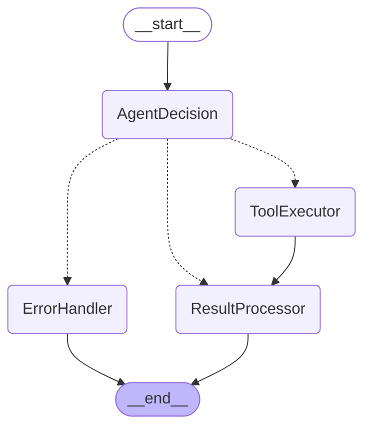

# pjt-final-gaida

Sesac GADA 과정 1기 최종프로젝트: **AI 기반 운동 및 식단 관리 애플리케이션**

## 🚀 프로젝트 소개

`pjt-final-gaida`는 사용자의 운동 기록과 식단 데이터를 관리하고, AI 코치를 통해 개인화된 피드백과 전략을 제공하는 웹 애플리케이션입니다. 사용자는 자신의 운동 세션을 기록하고, '승리의 연대기' 차트를 통해 성장을 시각적으로 확인할 수 있으며, AI 에이전트와 대화하며 운동 기록을 조회하거나 추가할 수 있습니다.

## 🏛️ 아키텍처

본 프로젝트는 **이중 백엔드(Dual Backend)** 구조를 채택하여 웹 서비스와 AI 에이전트 기능을 분리하고 확장성을 확보했습니다.





-   **Express.js (Node.js) 백엔드**: 프론트엔드의 메인 API 서버 역할을 합니다. AI 코칭, 전략 브리핑, 데이터베이스 프록시 기능을 수행합니다.
-   **FastAPI (Python) 백엔드**: LangGraph 기반의 ReAct 에이전트를 API로 제공합니다. 복잡한 Tool-Calling 로직을 처리하여 사용자의 자연어 요청(예: "내 운동 기록 보여줘")을 수행합니다.

## 🛠️ 기술 스택

### 프론트엔드
*   **Tailwind CSS**: 반응형 디자인, 다크 모드 등 전체 UI 스타일링을 위한 유틸리티 우선 CSS 프레임워크.
*   **Chart.js**: '승리의 연대기' 기능에서 사용자의 운동 볼륨 변화를 시각화하는 차트 라이브러리.

### 백엔드
1.  **Express.js (Node.js)**
    *   **역할**: 웹 애플리케이션의 메인 API 서버.
    *   **주요 기능**: AI 코치(GPT 호출), Supabase 데이터 프록시.
2.  **FastAPI (Python)**
    *   **역할**: LangGraph 기반 ReAct 에이전트 API 서버.
    *   **주요 기능**: Tool-Calling, 자연어 기반 DB 상호작용.

### 데이터베이스
*   **Supabase**: PostgreSQL 기반의 BaaS(Backend as a Service). 운동 및 식단 데이터 저장소로 사용되며, 두 백엔드에서 모두 접근합니다.

### AI & 에이전트
*   **GPT (OpenAI)**: 프로젝트의 핵심 LLM. Express 서버의 AI 코치 기능과 FastAPI 에이전트의 의도 분석 및 Tool-Calling 결정에 사용됩니다.
    > 초기에는 전체 DB 내용을 컨텍스트로 전달하기 위해 Context Window가 큰 Gemini를 사용했으나, LangGraph를 도입하여 정교한 Tool-Calling이 가능해지면서 GPT로 전환했습니다.
*   **LangGraph**: ReAct 패턴의 AI 에이전트를 구축하기 위한 프레임워크. `AgentDecision`, `ToolExecutor` 등의 노드를 정의하여 상태 기반의 자율적 에이전트를 구현합니다.
*   **LangChain**: LangGraph의 기반 기술. LLM, Tool, Prompt를 유기적으로 결합하는 데 사용됩니다.

### 계획 중인 기술
*   **LangSmith**: 에이전트의 실행 과정을 추적, 디버깅, 평가하기 위한 플랫폼. 추후 도입하여 에이전트의 안정성과 성능을 높일 계획입니다.

## 🏁 실행 방법

### 1. 웹 애플리케이션 서버 (Express.js)

프론트엔드와 메인 API를 실행합니다.

```bash
# server.js가 위치한 디렉토리로 이동
cd /path/to/your/project/root

# 종속성 설치
npm install

# 서버 실행
node server.js
```

### 2. LangGraph 에이전트 서버 (FastAPI)

Tool-Calling을 처리하는 AI 에이전트를 실행합니다.

```bash
# langgraph-agent 디렉토리로 이동
cd /path/to/your/project/langgraph-agent

# 종속성 설치
pip install -r requirements.txt

# 서버 실행
uvicorn graph_builder:fastapi_app --reload
```
